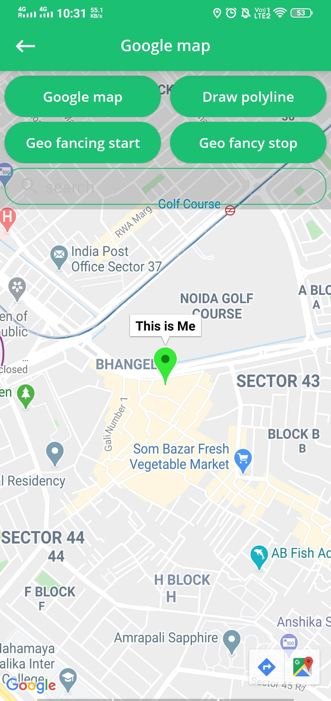
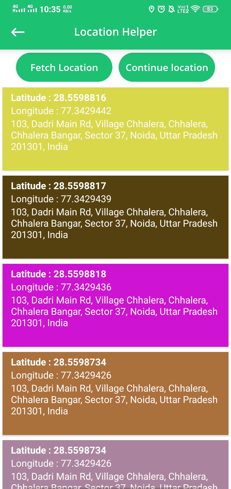
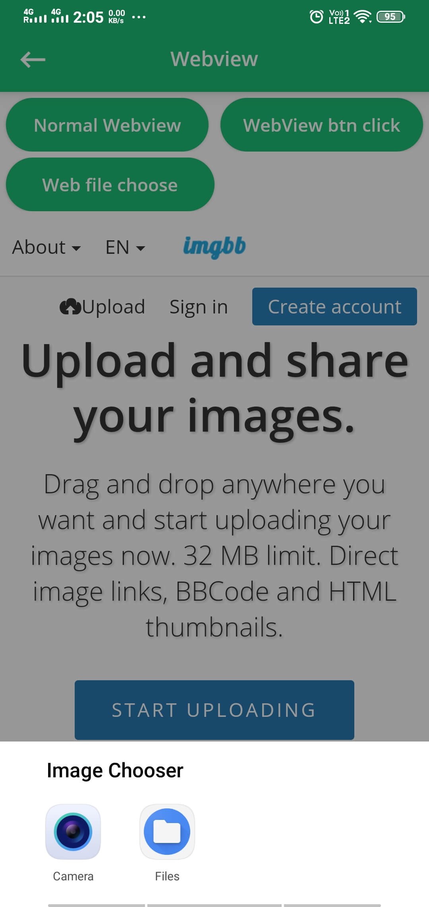

# Kotlin Demo

[](LICENSE)


[](https://www.codacy.com/app/webaddicted/KotlinProject)
[](https://www.codacy.com/app/webaddicted/KotlinProject)

# Kotlin Project with all latest feature

Gives a detailed explanation of working all the features/functionality/integrations in android application development.

***You can Install and test latest Kotlin Demo app from below 👇***

[](https://github.com/webaddicted/KotlinProject/tree/master/apk/KotlinDemo.apk)


## Feature/screen/design

This repository provides the following components that are common to our open source projects:
<h2>Feature</h2>


1) OnBoarding screen
2) Login/signup screen
3) Simple all default widget


    
    
    
    
    
    


4) AndroidX
5) Base location (track location)
6) Permission handler
7) Local media file picker (File Picker)
8) Google map
9) Geo fancing (enter & exit event)


    
    


10) Room database
11) Calligraphy fonts
12) Koin for DI(Dependency inversion)
13) Custom calendar with (disable date, multiple/single selection, edited date)
14) Api calling
15) Sms retriever Api 
16) MVVM(model, view, viewModel)
17) Android Dark theme


    
    


18) Webview (Click/ file access)
19) Retrofit
20) Custom Dialog
21) Create dynamic layout


    
    
    
    


22) Shared Preference
23) Speech to text/Text to speech
24) Animation
25) Recycler View with animation and load more property(Grid View/ Staggred view)
26) Expendable and spinner list view
27) Different type of sharing(text/image/file/link)
28) Broadcast Receiver(Normal/Ordered)
29) Services(Normal/Bind/Intent service)
30) Timer using(Handler/Countdown timer)
31) Ecommerce app(Login/Signup/verification/Deshboard/category listing)


    
    
    
    


32) Navigation drawer(both side left/right)
33) Zoom image(Single click/ Double finger)
34) Different Style of Notification
35) Animated Circle
36) Fab Button
37) FingerPrint Access
38) Fetch device all image
39) Fetch device all SMS
40) Fetch device all Contact


    
    


41) Take Screenshot
42) Restrict Screenshot
43) Tab and ViewPager
44) Rate Your App Feature
45) Create PDF and save
46) Device Info like :
    * Battery detail
    * Bluetooth detail
    * Camera detail
    * Display detail
    * OS detail
    * Storage detail
    * System app detail
    * Installed app detail
    * Processor detail

47) Collapse and expend animation
48) Exo player (Single & In List)

    
 


49) Bottom Sheet
50) Bottom Navigation
51) Capture image when user blink
52) Swipe to refresh
53) Ripple Effect
54) Arc Layout
55) Collapse Toolbar (With Different behavior)
56) Avoid Double click


    
    


57) Firebase Login Authentication with method :
    * Google Login Authentication
    * Facebook Login Authentication
    * Twitter Login Authentication
    * Phone Login Authentication
    * Email/Password Login Authentication
    * Anonymous Login Authentication

58) Firebase ML Kit integrated :
    * Text recognition (On-Device/Cloud)
    * Face detection (On-Device)
    * Object detection and tracking (On-Device)
    * Image labeling (On-Device/Cloud)
    * Barcode scanner (On-Device)
    * Landmark recognition (Cloud)
    * Language ID (On-Device)
    * On-device translation (On-Device)
    * Smart Reply (On-Device)


    
    
    
    


59) Firebase push notification
60) Firebase Database Integrated
61) Firebase Storage Integrated
62) Firebase Crashlytic Integrated
63) Firebase Analyic Integrated
64) PIP (Picture In Picture)
65) Read Call Logs


### UI Design Library

   * [Awesome UI Design](https://github.com/thanhtoan1196/awesome-android-ui)
   * [Awesome Android](https://github.com/vimalcvs/Awesome-Android-UI#UI)
   * [Awesome UI](https://github.com/XPGSnail/awesome-android-ui)


### Coding library

   * [Awesome Code](https://github.com/JStumpp/awesome-android)


### Image Resources

   * [icons8](https://icons8.com/illustrations)
   * [undraw](https://undraw.co/illustrations)

### Convert Video into GIF
 
  * [Video to GIF](https://www.onlineconverter.com/video-to-gif)
  * [Video to GIF](https://hnet.com/video-to-gif)
  * [Tinypng Compress Image](https://tinypng.com/)
  * [Resize Image](https://resizeimage.net/)
  * [Logo Creator](https://www.freelogoservices.com/)
  * [Png Image Crop](https://onlinepngtools.com/crop-png)
  * [Image Create For PlayStore](https://www.appstorescreenshot.com/)
  * [Merge Image Horizontally](https://www.filesmerge.com/merge-images)
  * [Mock Location](https://play.google.com/store/apps/details?id=ru.gavrikov.mocklocations&hl=en_IN&gl=US)
  
## LICENSE
```


                                 Apache License
                           Version 2.0, January 2004
                        http://www.apache.org/licenses/

             TERMS AND CONDITIONS FOR USE, REPRODUCTION, AND DISTRIBUTION

```

